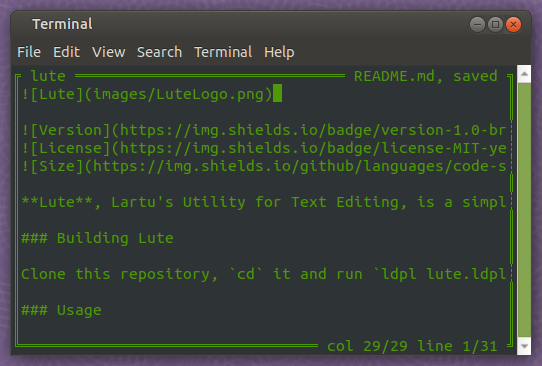

**Lute**, Lartu's Utility for Text Editing, is a simple, no-nonsense text editor for Unix and general \*nix systems written in LDPL. While written as a proof of concept for the [LDPL Programming Language](https://github.com/lartu/ldpl), Lute is completely functional and has been written using mostly itself as the text editor for its code.

Lute has been developed using the [LDPL Ncurses Library](https://github.com/Lartu/ldpl-ncurses).

### Building Lute

Clone this repository, `cd` it and run `ldpl lute.ldpl -o=lute`. You need to have [LDPL](https://github.com/lartu/ldpl) and **libncurses** installed to build Lute. If you are on Debian, you may install libncurses by running `apt install libncurses-dev`.

### Releases

You can download pre-compiled binaries of Lute for amd64 Linux from the [releases](https://github.com/Lartu/lute/releases) section of this repository.

### Usage

Run `lute <file>` to open `<file>` and edit it.

### Shortcuts
 - **Arrow Keys**: move across the text.
 - **Page Up** and **Page Down**: move up or down 10 lines, respectively.
 - **End** and **Start**: move to the end or the beginning of the line, respectively.
 - **Control-W**: turn debug mode on and off.
 - **Control-O**: save.
 - **Control-X** and **Control-C**: quit.
 - **Control-T**: change UI colors.
 - **Control-K**: add a line to the copy-stack.
 - **Control-U**: paste all the copy-stack before the current line.
 - **Control-R**: empty the copy-stack.
 - **Control-D**: delete the current line.
 
 ### License
 Lute was created by [Lartu](https://lartu.net) and is released under the MIT license.
